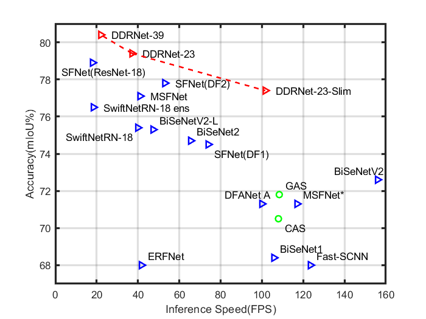
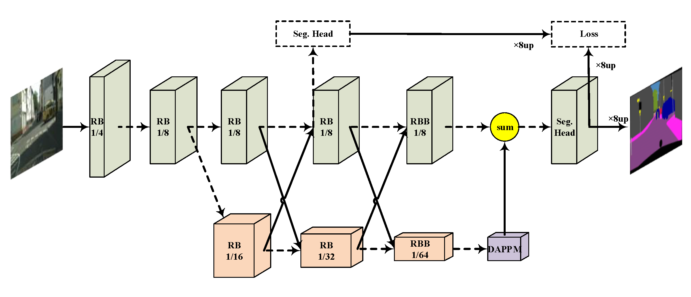
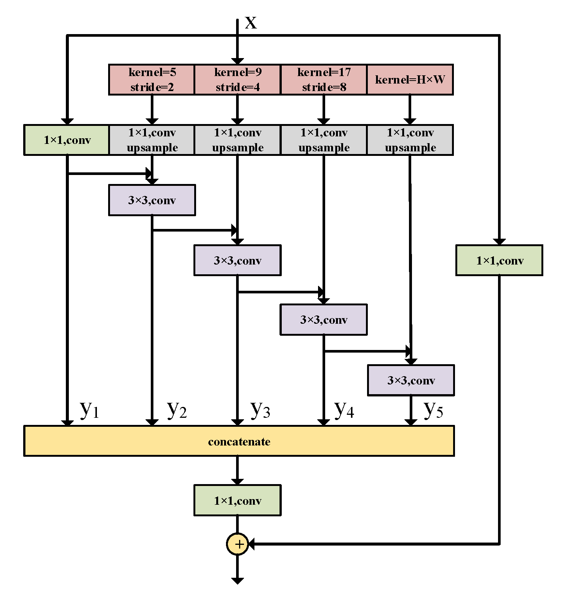

# The official implementation of "Deep Dual-resolution Networks for Real-time and Accurate Semantic Segmentation of Road Scenes"
 

**Achieve state-of-the-art trade-off between accuracy and speed on cityscapes and camvid, without using inference acceleration and extra data!** 


The overall architecture of our methods.


The details of "Deep Aggregation Pyramid Pooling Module(DAPPM)".

## Usage

Currently, this repo contains the model codes and pretrained models for classification and semantic segmentation. You can refer to [
HRNet-Semantic-Segmentation-pytorch-v1.1](https://github.com/HRNet/HRNet-Semantic-Segmentation/tree/pytorch-v1.1) for training and testing our models locally. We will release the whole train and test codes based on it later.

## Notice

There are some basic training tricks you should employ to reproduce our results including class balance sample, ohem, crop size of 1024x1024. More details can be found in the [paper](https://arxiv.org/abs/2101.06085). Please keep "align_corners=False" in all places if you want to use our pretrained models for evaluation directly.

## Pretrained models

DDRNet_23_slim on ImageNet(top-1 error:29.8): [link](https://pan.baidu.com/s/15_dzW6Ncj1EOmP20whmngw) keywords: 3vmn

DDRNet_23 on ImageNet(top-1 error:24.1): [link](https://pan.baidu.com/s/1XAY3nCE2v1uE4gDJnOJ-Kg) keywords: yd76

DDRNet_39 on ImageNet(top-1 error:22.7): [link](https://pan.baidu.com/s/1F0q3JOl_7fUz7sRUkHPTbA) keywords: qumr

DDRNet_23_slim on Cityscapes(val mIoU:77.8): [link](https://drive.google.com/file/d/1d_K3Af5fKHYwxSo8HkxpnhiekhwovmiP/view?usp=sharing)

DDRNet_23 on Cityscapes(val mIoU:79.5): [link](https://drive.google.com/file/d/16viDZhbmuc3y7OSsUo2vhA7V6kYO0KX6/view?usp=sharing)

## Results on Cityscapes server

DDRNet_23_slim: [77.4](https://www.cityscapes-dataset.com/anonymous-results/?id=552a0548931fb49759bde6216f8472f60c470f768ac78b4cd08bf30a3a161e82)

DDRNet_23: [79.4](https://www.cityscapes-dataset.com/anonymous-results/?id=5766a6aff8efa27239e2f1d1085052cdb0a2351a66ef00d1610c9ea226e6770b)

DDRNet_39: [80.4](https://www.cityscapes-dataset.com/anonymous-results/?id=c9a859907b83426a71dcdcb08a7c0ad5b69111a45e61e3fdef5df1ddc680268c) [81.9](https://www.cityscapes-dataset.com/anonymous-results/?id=594e60787c8af8203cd37e5094c764a93b5a0c35e1e699d89ce4a64cb9da447b)(multi-scale and flip)

## Citation
If you find this repo is useful for your research, Please consider citing our paper:

```
@article{hong2021deep,
  title={Deep Dual-resolution Networks for Real-time and Accurate Semantic Segmentation of Road Scenes},
  author={Hong, Yuanduo and Pan, Huihui and Sun, Weichao and Jia, Yisong and others},
  journal={arXiv preprint arXiv:2101.06085},
  year={2021}
}
```
